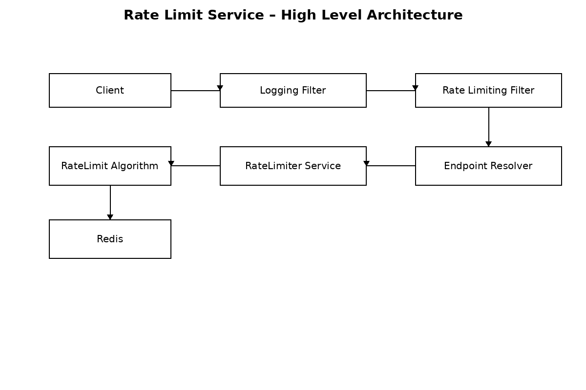

# Rate Limit Service

A **production-ready, Redis-backed Rate Limiting Service** built with Spring Boot.  
It supports **endpoint-level rate limiting**, **multiple algorithms**, and **primary/secondary limits** with strict configuration validation.

---

## 🚀 Features

- Endpoint-level rate limiting (HTTP method + path)
- Multiple algorithms (pluggable, config-driven):
  - Token Bucket
  - Leaky Bucket
  - Fixed Window
  - Sliding Window
- Primary (API-level) and Secondary (identifier-level) limits
- Redis-backed with atomic enforcement (Lua / Redis primitives)
- Fail-open / fail-close modes
- Strict startup-time configuration validation
- Opt-in rate limiting (only configured endpoints are limited)

---

## 🧠 Supported Algorithms

| Algorithm | Use Case |
|---------|---------|
| Token Bucket | Controlled bursts |
| Leaky Bucket | Smooth traffic |
| Fixed Window | Simple quotas |
| Sliding Window | Accurate rolling limits |

---

## 🏗 High-Level Architecture


---

## 🖼 Architecture & Flow Diagrams

### High-Level Architecture


```
Client
  → Logging Filter
  → Rate Limiting Filter
  → Endpoint Resolver
  → RateLimiter Service
  → Selected Algorithm
  → Redis
```

---

## 📦 Prerequisites

- Java 17+
- Redis (local or remote)
- Gradle or Maven
- Spring Boot 3+

---

## ⚙️ Configuration

### Redis Configuration

```yaml
redis:
  host: localhost
  port: 6379
  timeout: 15000ms
```

---

### Rate Limiter Configuration

```yaml
rate-limiter:
  enabled: true
  failure-mode: FAIL_OPEN
  algorithm: sliding-window

  endpoints:
    - method: POST
      path: /users
      primary:
        capacity: 100
        time-window: 60

    - method: GET
      path: /users
      primary:
        capacity: 500
        time-window: 60
      secondary:
        source: HEADER
        key: uuid
        capacity: 20
        time-window: 10
```

---

## 🔑 Configuration Rules (Important)

- Only **configured endpoints** are rate-limited
- Primary limit is **mandatory**
- Secondary limit is **optional**
- Algorithm-specific fields are **strictly enforced**

### Algorithm → Required Field Mapping

| Algorithm | Required Field |
|--------|----------------|
| token-bucket | `refill-rate` |
| leaking-bucket | `leak-rate` |
| fixed-window | `time-window` |
| sliding-window | `time-window` |

Invalid combinations cause **startup failure**.

---

## 🔁 Primary vs Secondary Limits

- **Primary**: API-level limit (applies to all requests)
- **Secondary**: Identifier-level limit (e.g. per user, per driver)

Example:
```yaml
secondary:
  source: HEADER
  key: uuid
  capacity: 20
  time-window: 10
```

---

## 🧯 Failure Modes

| Mode | Behavior |
|----|---------|
| FAIL_OPEN | Allow requests if Redis is unavailable |
| FAIL_CLOSE | Reject requests if Redis is unavailable |

---

## 🧪 Testing Strategy

- Unit tests for configuration validation and algorithms
- Integration tests with Redis
- Failure mode tests (Redis down)

---

## 📊 Redis Key Format

```
rl:{algorithm}:{scope}:{method}:{path}[:identifier]
```

Examples:
```
rl:sliding-window:primary:POST:/users
rl:sliding-window:secondary:GET:/users:UUID123
```

---

## 🔌 Extending the System

### Add a New Algorithm
1. Implement `RateLimitAlgorithm`
2. Annotate with `@Component("algorithm-name")`
3. Add validation rules
4. Select via configuration

No changes required in filters or services.

---

## 📄 Documentation

- `Rate_Limit_Service_HLD.md` – High Level Design
- `Rate_Limit_Service_LLD.md` – Low Level Design

---

## 📌 Summary

This Rate Limit Service provides a **robust, extensible, and production-grade solution** for API protection, suitable for modern distributed systems.

Happy building!
